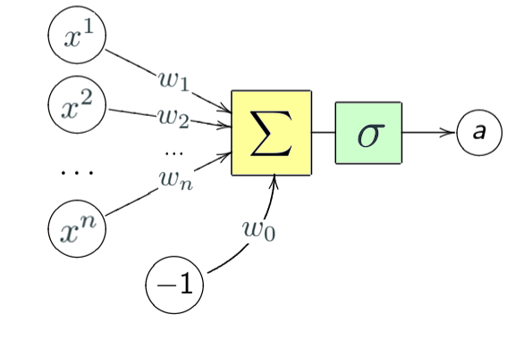

В этом уроке мы продолжим тему распознавания образов. Для тестирования нашего алгоритма будем
использовать датасет MNIST.

MNIST (Mixed National Institute of Standards and Technology database) является основной базой при тестировании систем
распознавания образов, а также широко используемой для обучения и тестирования алгоритмов машинного обучения.
Она была создана перегруппировкой образов из оригинальной базы NIST, которая являлась достаточно сложной для распознавания.
Кроме этого, были выполнены определенные преобразования (образы были нормализованы и сглажены для получения градаций
серого цвета).

### Neuron

The basic unit of a neural network is a neuron.
A neuron takes inputs, does some math with them, and produces one output.

The operations done by the neurons are simple:

First, it adds up the value of every input. On the figure, there are $n$ inputs ($x^1, x^2, \dots x^n$ ) coming to the neuron.

This value is multiplied, before being added, by another variable called “weight” ($w_1, w_2, \dots w_n$).
Weights are the only values that will be modified during the learning process. A bias value $w_0$ may be added to the total value calculated.

After all those summations, the neuron finally applies a function called “activation function” $\sigma$ to the obtained value.
Activation function usually serves to turn the total value calculated before to a number between `0` and `1`.

A commonly used activation function is the [sigmoid](https://en.wikipedia.org/wiki/Sigmoid_function) function.

The mathematical formula is as follows:

$$\sigma(\sum\limits_{j=1}^n w_j x^j - w_0) = \sigma(\langle \mathbf{w}, \mathbf{x} \rangle)$$

### Neural network

A neural network is nothing more than a bunch of neurons connected together.

Neural Networks consist of the following components:
- An input layer
- An arbitrary amount of hidden layers
- An output layer
- A set of weights and biases between each layer, $W$
- A choice of activation function for each hidden layer $\sigma$

Here is 2-layer Neural Network. The input layer is excluded when counting the number of layers in a Neural Network.

Each iteration of the training process consists of the following steps:
- Calculating the predicted output, known as feedforward
- Updating the weights and biases, known as backpropagation

### Задание

Параметр конструктора layers задаёт количество нейронов в каждом слое в виде списка.
Реализуйте прямой проход (`forward`) сети.

На forward шаге объект проходит через нейросеть и вычисляются выходные значения нейронов скрытых слоёв и выходного слоя.
В качестве функции активации в данном задании используйте сигмоиду.
